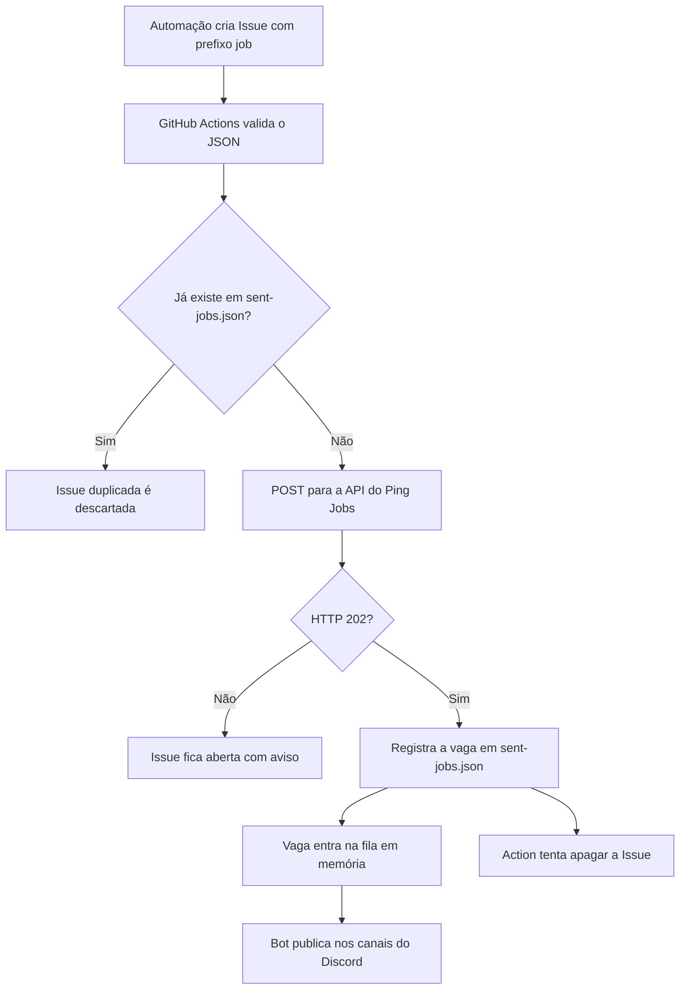

# Ping Jobs

Bot em Go que recebe vagas por HTTP e publica cada uma em canais do Discord. O bot mantém conexão com o Gateway para aparecer online, mas não lê mensagens nem recebe comandos.

Este guia mostra como configurar o projeto do zero, executá-lo com Docker Compose e, opcionalmente, usar GitHub Issues e GitHub Actions para encaminhar vagas automaticamente.

## Índice

- [Como funciona](#como-funciona)
- [O que você precisa](#o-que-voc%C3%AA-precisa)
- [1. Criar e convidar o bot do Discord](#1-criar-e-convidar-o-bot-do-discord)
- [2. Encontrar os IDs do servidor e do canal](#2-encontrar-os-ids-do-servidor-e-do-canal)
- [3. Configurar o arquivo `.env`](#3-configurar-o-arquivo-env)
- [4. Executar localmente](#4-executar-localmente)
- [5. Publicar na VPS com Docker Compose](#5-publicar-na-vps-com-docker-compose)
- [6. Testar a API](#6-testar-a-api)
- [7. Configurar GitHub Actions](#7-configurar-github-actions)
- [8. Usar uma automação do ChatGPT](#8-usar-uma-automa%C3%A7%C3%A3o-do-chatgpt)
- [Limites e comportamento da fila](#limites-e-comportamento-da-fila)
- [Solução de problemas](#solu%C3%A7%C3%A3o-de-problemas)

## Como funciona



O endpoint recebe um objeto JSON com `title`, `content`, `link` e `date`. No Discord, o título fica clicável, o conteúdo aparece na descrição do embed e a data aparece em um campo próprio.

Exemplo do embed:

> **Desenvolvedor Go** *(link para a vaga)*
>
> Descrição e requisitos da vaga.
>
> **Data** 2026-09-29

## O que você precisa

- Uma aplicação e um bot no [Discord Developer Portal](https://discord.com/developers/applications).
- Um servidor do Discord onde você possa adicionar o bot e configurar permissões.
- Docker Engine e Docker Compose na máquina de execução, ou Go 1.26+ para executar localmente.
- Para receber vagas do GitHub: um repositório com Issues e GitHub Actions habilitados.
- Para usar uma URL pública: domínio com HTTPS e um proxy reverso para a API da VPS.

## 1. Criar e convidar o bot do Discord

1. No Discord Developer Portal, crie uma Application e abra a seção **Bot**.
2. Crie o bot e copie o token. Guarde-o como segredo; ele será usado em `DISCORD_BOT_TOKEN`.
3. Na configuração de instalação/OAuth2, gere um convite com o escopo `bot`.
4. Conceda ao bot estas permissões nos canais de destino:
   - `Send Messages`
   - `Embed Links`
5. Abra o convite e adicione o bot ao seu servidor.

O bot não precisa da intent privilegiada **Message Content**: ele não lê nem responde a mensagens. Depois de iniciado, deve aparecer online enquanto a conexão Gateway estiver ativa.

## 2. Encontrar os IDs do servidor e do canal

1. No Discord, abra **Configurações do usuário → Avançado** e habilite **Modo desenvolvedor**.
2. Clique com o botão direito no servidor e escolha **Copiar ID do servidor**.
3. Clique com o botão direito no canal de texto e escolha **Copiar ID do canal**.
4. Confirme que o bot está no servidor e tem permissão para enviar mensagens nesse canal.

O formato de cada destino é `ID_DO_SERVIDOR:ID_DO_CANAL`. Separe vários destinos por vírgula, sem espaços. Nesta versão, cada ID de servidor pode aparecer apenas uma vez na lista.

```text
111111111111111111:222222222222222222,333333333333333333:444444444444444444
```

Os IDs acima são exemplos fictícios. Use os IDs copiados no Discord.

## 3. Configurar o arquivo `.env`

Na raiz do projeto, crie o arquivo local de configuração:

```sh
cp -n .env.example .env
```

Edite `.env` e preencha os valores:

```dotenv
DISCORD_BOT_TOKEN=cole-aqui-o-token-do-bot
API_TOKEN=cole-aqui-um-token-aleatorio
HTTP_PORT=8080
DISCORD_DESTINATIONS=ID_DO_SERVIDOR:ID_DO_CANAL
```

Gere um token aleatório para proteger a API:

```sh
openssl rand -hex 32
```

Copie o resultado para `API_TOKEN`. Para mais de um destino, use vários pares `servidor:canal` separados por vírgula:

```dotenv
DISCORD_DESTINATIONS=111111111111111111:222222222222222222,333333333333333333:444444444444444444
```

| Variável | Obrigatória | Uso |
| --- | --- | --- |
| `DISCORD_BOT_TOKEN` | Sim | Token da Application no Discord Developer Portal. |
| `API_TOKEN` | Sim | Token Bearer exigido por `POST /messages`. |
| `DISCORD_DESTINATIONS` | Sim | Pares `guild_id:channel_id` separados por vírgula. |
| `HTTP_PORT` | Não | Porta da VPS publicada pelo Docker Compose; padrão `8080`. |
| `HTTP_ADDR` | Não | Endereço de escuta da API; padrão `:8080`. O Compose define `0.0.0.0:8080` no container. |

**Não compartilhe nem faça commit do `.env`.** O arquivo está ignorado pelo Git. Nunca inclua tokens no README, em Issues ou no prompt de uma automação.

## 4. Executar localmente

Com Go 1.26 ou superior instalado, carregue as variáveis e inicie o bot:

```sh
set -a
. ./.env
set +a
go run ./cmd/pingbot
```

Você deverá ver logs JSON indicando que o bot conectou ao Gateway e que o servidor HTTP iniciou. Deixe o processo em execução para manter o bot online.

Em outro terminal, verifique a API:

```sh
curl -i http://localhost:8080/healthz
```

O resultado esperado é `204 No Content`.

## 5. Publicar na VPS com Docker Compose

Copie o projeto para a VPS, crie e preencha o `.env` seguindo a etapa anterior. Depois, na raiz do projeto, execute:

```sh
docker compose -f compose.yml up --build -d
```

Confira se o container está ativo e acompanhe os logs:

```sh
docker compose -f compose.yml ps
docker compose -f compose.yml logs -f pingbot
```

Após mudanças no código, reconstrua e reinicie o serviço:

```sh
docker compose -f compose.yml up -d --build
```

Para parar:

```sh
docker compose -f compose.yml down
```

O serviço usa `restart: unless-stopped`, então o Docker o reinicia após uma falha ou reinicialização da VPS. O Compose publica a porta indicada por `HTTP_PORT` (por padrão, `8080`).

### Disponibilizar a API com HTTPS

O GitHub Actions precisa alcançar a API pela internet. A configuração deste repositório usa `https://jobs.zelchi.com/messages`. Para instalar sua própria cópia:

1. Aponte um domínio para a VPS.
2. Configure Caddy, Nginx ou outro proxy reverso com TLS/HTTPS.
3. Encaminhe as requisições para `http://127.0.0.1:8080` na VPS.
4. Restrinja no firewall o acesso externo direto à porta da API; deixe o acesso público pelo proxy HTTPS.
5. No arquivo `.github/workflows/publish-job.yml`, altere `API_URL` para `https://SEU_DOMINIO/messages`.

## 6. Testar a API

O endpoint de publicação é `POST /messages`. Todos os quatro campos são obrigatórios e devem ser strings. O corpo deve conter somente o JSON, sem bloco Markdown:

```json
{
  "title": "Desenvolvedor Go",
  "content": "Descrição e requisitos da vaga.",
  "link": "https://exemplo.com/vagas/desenvolvedor-go",
  "date": "2026-09-29"
}
```

Teste localmente, substituindo o valor de `API_TOKEN` pelo mesmo token do `.env`:

```sh
export API_TOKEN='seu-token-da-api'

curl -i -X POST http://localhost:8080/messages \
  -H "Authorization: Bearer $API_TOKEN" \
  -H 'Content-Type: application/json' \
  -d '{"title":"Desenvolvedor Go","content":"Descrição e requisitos da vaga.","link":"https://exemplo.com/vagas/desenvolvedor-go","date":"2026-09-29"}'
```

Uma resposta `202 Accepted` significa que a vaga entrou na fila do bot. Ela ainda pode levar alguns instantes para aparecer no Discord.

### Endpoints

| Método e caminho | Resultado |
| --- | --- |
| `GET /healthz` | `204 No Content` se o processo HTTP estiver ativo. |
| `POST /messages` | `202 Accepted` quando a vaga válida entra na fila. Exige `Authorization: Bearer <API_TOKEN>`. |

O título aceita até 256 caracteres, `content` até 4096, `link` até 2048 e `date` até 1024. O link precisa ser HTTP ou HTTPS.

## 7. Configurar GitHub Actions

O workflow incluído em `.github/workflows/publish-job.yml` recebe eventos de Issue `opened` e `edited`. Ele só processa Issues cujo título começa com `[job]`.

### 7.1 Habilitar Issues e Actions

No repositório do GitHub, confira em **Settings → General → Features** se **Issues** está habilitado. Confira também em **Settings → Actions → General** se Actions está permitido para o repositório.

### 7.2 Criar os Secrets

Abra **Settings → Secrets and variables → Actions → New repository secret** e crie estes dois valores:

#### `JOBS_API_TOKEN`

Use o mesmo valor configurado em `API_TOKEN` na VPS. O workflow envia esse token no cabeçalho Bearer para autenticar o POST.

#### `ISSUE_DELETE_TOKEN`

O workflow apaga Issues usando a mutação GraphQL `deleteIssue`. Para este repositório pessoal, crie um Fine-grained Personal Access Token pela conta proprietária `Zelchi`:

1. Abra **Settings → Developer settings → Personal access tokens → Fine-grained tokens**.
2. Gere um token com expiração.
3. Em **Resource owner**, escolha a conta proprietária do repositório.
4. Em **Repository access**, selecione **Only select repositories** e marque somente este repositório.
5. Em **Repository permissions**, conceda **Issues: Read and write**.
6. Salve o valor recém-gerado como o Secret `ISSUE_DELETE_TOKEN` no repositório.

Não adicione permissões extras. Não coloque PATs no `.env`, no YAML, no corpo da Issue ou na automação do ChatGPT. Em repositórios de organização, o proprietário da organização também precisa permitir a exclusão de Issues.

### 7.3 Criar uma Issue de teste

Crie uma Issue com título começando por `[job]`, por exemplo:

```text
[job] Teste da integração
```

O corpo deve ser somente um objeto JSON válido:

```json
{
  "title": "Teste da integração",
  "content": "Mensagem de teste enviada pelo GitHub Actions.",
  "link": "https://exemplo.com/vagas/teste",
  "date": "2026-09-30"
}
```

Em **Actions → Publish job to jobs.zelchi.com**, acompanhe estas etapas:

1. O workflow valida campos, tipos, URL e limites.
2. Consulta `sent-jobs.json` e descarta automaticamente vagas já enviadas.
3. Envia apenas vagas novas para a API e exige HTTP `202`.
4. Depois do `202`, registra a vaga em `sent-jobs.json`.
5. Só então tenta apagar permanentemente a Issue.

Se a API falhar, a Issue fica aberta com um comentário de erro e pode ser editada depois de corrigir o problema. Se a API aceitar a vaga, mas o PAT não conseguir apagar a Issue, ela fica aberta com um aviso. Nesse segundo caso, **não edite nem reenvie a Issue antes de confirmar a entrega no Discord**, porque a vaga pode já ter sido publicada.

> O `202 Accepted` confirma que a vaga entrou na fila em memória, não que já chegou ao Discord. A exclusão da Issue ocorre após o enfileiramento.

### 7.4 Formato que a automação deve criar

Para cada vaga nova, crie uma Issue:

- título começando exatamente com `[job] `;
- corpo contendo somente o JSON com `title`, `content`, `link` e `date`;
- link oficial e data em texto, por exemplo `2026-09-30`;
- nenhum token, cabeçalho de autorização ou bloco Markdown.

A exclusão remove o histórico da Issue, mas `sent-jobs.json` preserva o registro das vagas efetivamente enviadas. A automação deve consultar esse arquivo antes de reportar ou criar uma nova Issue.

## 8. Usar uma automação do ChatGPT

Se uma automação do ChatGPT com acesso ao GitHub for criar as Issues, inclua instruções parecidas com estas:

```text
Quando encontrar uma vaga nova válida:
1. Verifique se ela já foi reportada, usando empresa + cargo + URL.
2. Crie uma Issue no repositório configurado.
3. O título deve começar com "[job] ", seguido por cargo e empresa.
4. O corpo deve ser somente JSON válido, sem bloco Markdown.
5. Use exatamente os campos title, content, link e date; todos como strings.
6. Use o link oficial da vaga.
7. Nunca inclua tokens ou dados de autenticação.
```

Exemplo do corpo:

```json
{
  "title": "Desenvolvedor Backend Júnior — Empresa X",
  "content": "Júnior | Remoto no Brasil.\n\nRequisitos:\n- Node.js\n- TypeScript\n- APIs REST",
  "link": "https://empresa.example/jobs/123",
  "date": "2026-09-30"
}
```

O ChatGPT não precisa receber `API_TOKEN`, `JOBS_API_TOKEN` nem `ISSUE_DELETE_TOKEN`; os dois últimos ficam nos GitHub Actions Secrets.

## Controle de duplicidade

O arquivo `sent-jobs.json` funciona como histórico persistente das vagas já aceitas pela API. Antes de publicar uma nova Issue `[job]`, o workflow compara a vaga com esse histórico.

A deduplicação usa duas regras:

- URL canônica igual: a vaga é considerada duplicada mesmo quando a URL contém parâmetros de rastreamento diferentes.
- Mesmo título (cargo + empresa) enviado nos últimos 60 dias: a vaga também é considerada duplicada, protegendo contra links alternativos para a mesma oportunidade.

As execuções de publicação são serializadas com um único grupo de `concurrency`, evitando que duas Issues iguais passem pela verificação ao mesmo tempo.

Depois que a API responde com HTTP `202`, o workflow registra a vaga em `sent-jobs.json` antes de apagar a Issue. Se a gravação do histórico falhar, a Issue permanece aberta e recebe um aviso para evitar reenvio acidental.

Ao pesquisar novas vagas, use `sent-jobs.json` como fonte de verdade para saber o que já foi efetivamente enviado ao pipeline.

## Limites e comportamento da fila

- A fila fica somente na memória do processo; reiniciar ou parar o container apaga as vagas pendentes.
- Cada vaga fica pendente por no máximo 10 minutos e é removida após entrega a todos os destinos ou expiração.
- A fila aceita até 1000 vagas pendentes.
- Se o envio falhar em algum canal, o bot tenta novamente somente os destinos pendentes enquanto a vaga não expirar.
- O endpoint responde `202` antes da publicação assíncrona no Discord.

## Solução de problemas

| Sintoma | O que conferir |
| --- | --- |
| Bot aparece offline | Verifique `DISCORD_BOT_TOKEN`, conexão de saída da VPS com o Discord e `docker compose -f compose.yml logs -f pingbot`. |
| Erro ao iniciar por configuração | Confira se `API_TOKEN`, `DISCORD_BOT_TOKEN` e `DISCORD_DESTINATIONS` estão preenchidos. |
| API retorna `401` | O cabeçalho Bearer não corresponde ao `API_TOKEN` configurado na aplicação. |
| API retorna `400` | Confira se o corpo é JSON válido, contém somente os quatro campos e usa uma URL HTTP/HTTPS. |
| API retorna `503` | A fila está cheia; veja os logs e aguarde processamento ou expiração. |
| Vaga não aparece no Discord | Confira se o bot está no servidor correto, se os IDs são do servidor/canal e se ele tem `Send Messages` e `Embed Links`. |
| Action falha antes do POST | Confira o JSON da Issue, o prefixo `[job]` e o Secret `JOBS_API_TOKEN`. |
| Action recebeu `202`, mas a Issue ficou aberta | Confira `ISSUE_DELETE_TOKEN`, acesso ao repositório e permissão **Issues: Read and write**. Não edite a Issue até confirmar se a vaga já chegou ao Discord. |

## Segurança

- Mantenha `DISCORD_BOT_TOKEN`, `API_TOKEN` e PATs fora do código e do histórico Git.
- Use `.env` apenas na máquina que executa o bot; no GitHub, use Actions Secrets.
- Em produção, exponha a API por HTTPS e limite o acesso direto à porta publicada pelo Docker.
- Se um token for exposto, revogue-o e gere outro imediatamente.
